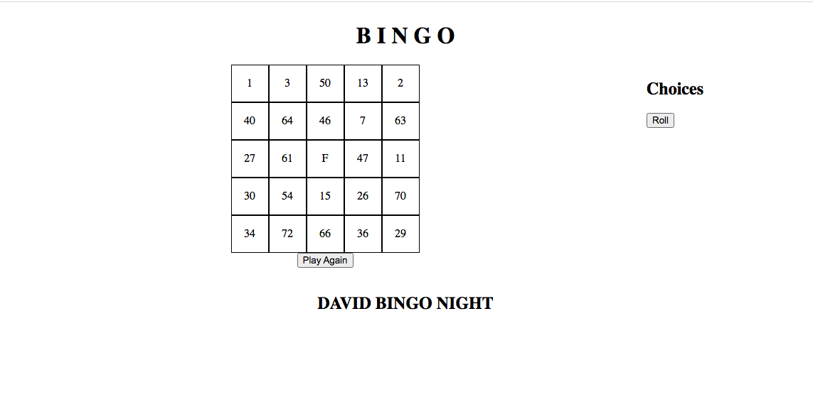
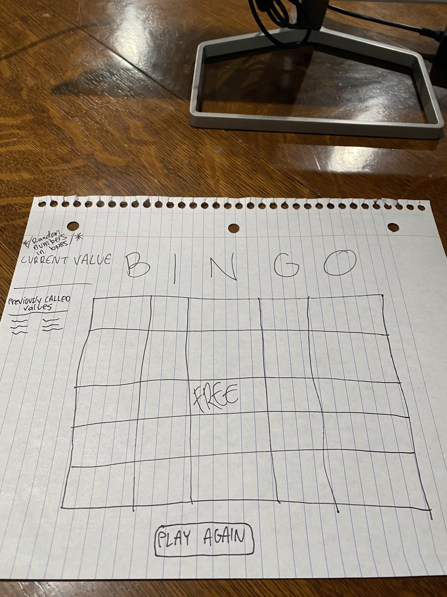

# B-I-N-G-O

## Description

Browser-based Bingo game coded in JavaScript, HTML, and CSS.

#### MVP

- As a user, I want a browser-based interface so that I can play the game.
- As a user, I want to place a tic so that I can interact with the game.
- As a user, I want the game to reach a win state so that I know who won and can play again.
- As a user, I want a random board given to me when the game loads.
- As a user, I want the ability to restart the game.
- As a user, I want the game to indicate whether I won or lost so I can either keep playing or start a new game.
- As a user, I want to be able to see which values have been called so I know if one of my squares were called or not.

### Stretch Goals

- As a user, I want to see a screen that tells me how to play the game.
- As a user, I want to be able to see how many times I won so I can brag to my friends.
- As a user, I want to be able to customize the game so it looks the way I want it to.
- As a user, I want to play against multiple bots.
- As a user, I want the ability to keep my same board or get a new one.
- As a user, I want to play different variations of Bingo in case I get bored and would like to change things up. (i.e win by creating an 'L' on the board, win by blackout etc.)

### Wireframes

## Installation
1. Clone the repository down to your machine.
2. Open the `index.html` file in your browser.

### Unsolved problems
1. Winning methods and a message to let you know that you've one.
2. Getting the 'FREE' box.
3. Looks. The game is visually displeasing.
4. Creating the setInterval for the choices to be displayed automatically.
